<!--
author:   Lennart Rosseburg für twillo

email:    support.twillo@tib.eu

comment:  Eine Selbstlerneinheit für Dynamische Datenstrukturen mit Beispielen zum Implementieren (Java) und interaktiven H5P-Quizfragen zur Selbstkontrolle. Diese Seite ist lizenziert unter der [Lizenz CC-BY-SA (3.0)](https://creativecommons.org/licenses/by-sa/3.0/legalcode).

language: de

mode:     Textbook

version:  0.0.1

date:     07/06/2022

logo:     docs/thumbnail.JPG

icon:     docs/twillo_logo.svg

link:     https://cdn.jsdelivr.net/gh/TorroRosso46/LiaScript_DynamischeDatenstrukturen/custom.css

script:   https://h5p.org/sites/all/modules/h5p/library/js/h5p-resizer.js
-->

# Dynamische Datenstrukturen

> # Lizenzhinweis
>
> Der Kurs *Dynamische Datenstrukturen*, von Lennart Rosseburg für twillo, ist lizenziert unter der [Lizenz CC-BY-SA (3.0)](https://creativecommons.org/licenses/by-sa/3.0/legalcode).
>
> #### Unter Nutzung von
>
> - Dem [Kapitel "Dynamische Datenstrukturen"](https://de.wikiversity.org/wiki/Kurs:Algorithmen_und_Datenstrukturen/Vorlesung/Dynamische_Datenstrukturen) aus dem [Kurs "Algorithmen und Datenstrukturen"](https://de.wikiversity.org/wiki/Kurs:Algorithmen_und_Datenstrukturen), von Wikiversity unter der Beteiligung folgender [Autor:innen](https://de.wikiversity.org/w/index.php?title=Kurs:Algorithmen_und_Datenstrukturen/Vorlesung/Dynamische_Datenstrukturen&action=history), unter der [Lizenz CC-BY-SA (3.0)](https://creativecommons.org/licenses/by-sa/3.0/legalcode).

<!-- style="background-color:transparent;" -->
> Diese Selbstlerneinheit konzentriert sich auf die Funktionsweise verschiedener Dynamischer Datenstrukturen und enthält interaktive Aufgaben um das Gelernte zu überprüfen und zu verinnerlichen.

<!--  style="background-color:#A6D492;" -->
> #### Ziel des Kurses:
>
> Am Ende dieser Selbstlerneinheit sollten Sie die vorgestellten Dynamischen Datenstrukturen kennen, unterscheiden und selbst anwenden können.

## Einleitung

Unter [dynamischen Datenstrukturen](https://de.wikipedia.org/wiki/Datenstruktur) verstehen wir Datenstrukturen bei denen man Elemente löschen und hinzufügen kann, eine interne Ordnung (z.B. Sortierung) vorliegt und diese Ordnung unter Änderungen aufrecht erhalten bleibt. Ein Beispiel sind Lineare Datenstrukturen und Sortierung. Bei einer **unsortierten** Liste sind Änderungen einfach, aber der Zugriff aufwändig. Bei einer **sortierten** Liste sind die Änderungen schwierig, aber dafür der Zugriff einfach. Für diesen Trade-of ist eine “intelligente Datenstruktur” gesucht, die Änderungen **und** Zugriffe einfach, sprich effizient, hält. Viele dynamische Datenstrukturen nutzen Bäume als Repräsentation.

> Die Inhalte dieses Kurses bauen auf dem Buch [Algorithmen und Datenstrukturen: Eine Einführung mit Java](https://dpunkt.de/produkt/algorithmen-und-datenstrukturen/) von Gunter Saake und Kai-Uwe Sattler auf. Daher empfiehlt sich dieses Buch, um das vorgestellte Wissen zu vertiefen.

> Desweiteren erwarten Sie in diesem Kurs Beispiele zum Implementieren der vorgestellten dynamischen Datenstrukturen. Die benutzte Programmiersprache in diesen Beispielen ist **Java**.

## Grundlagen

Bevor wir die einzelnen dynamischen Datenstrukturen vorstellen, ein kurzer Abschnitt zu den benötigten Grundlagen.

### Bäume

In diesem Kapitel werden [Bäume](https://de.wikipedia.org/wiki/Baum_%28Graphentheorie%29) als kurzen Einschub behandelt. Ein Baumelement $e$ ist ein Tupel $e=(v,\lbrace e_{1},...,e_{n}\rbrace )$ mit $v$ vom Wert $e$ und $\lbrace e_{1},...,e_{n}\rbrace$ sind die Nachfolger, bzw. Kinder von $e$. Ein Baum $T$ ist ein Tupel $T=(r,\lbrace e_{1},...,e_{n}\rbrace )$ mit $r$ als Wurzelknoten (ein Baumelement) und $\lbrace e_{1},...,e_{n}\rbrace$ als Knoten (Baumelemente) des Baumes mit $r\in \lbrace e_{1},...,e_{n}\rbrace$ und für alle $e_{i}=(v_{i},K_{i})$ und $e_{j}=(v_{j},K_{j})\in \lbrace e_{1},...,e_{n}\rbrace$ gilt $K_{i}\bigcap K_{j}=\emptyset$

Man spricht von einem geordneten Baum, wenn die Reihenfolge der Kinder $\lbrace e_{1},..,e_{n}\rbrace$ eines jeden Elements $e=(v,\lbrace e_{1},...,e_{n}\rbrace )$ festgelegt ist (schreibe dann $(e_{1},...,e_{n})$ statt $\lbrace e_{1},...,e_{n}\rbrace )$.

---

<h4>Beispiel:</h4>

<div style="width:80%;margin:auto;">
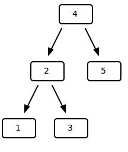
<p>
$T=(v_{4},\lbrace v_{1},v_{2},v_{3},v_{4},v_{5}\rbrace )$

- $v_{1}=(1,\lbrace \rbrace )$
- $v_{2}=(2,\lbrace v_{1},v_{3}\rbrace )$
- $v_{3}=(3,\lbrace \rbrace )$
- $v_{4}=(4,\lbrace v_{2},v_{5}\rbrace )$
- $v_{5}=(5,\lbrace \rbrace )$
</p>
</div>

<div style="clear:both;width:80%;margin:auto;padding-top:10px;">
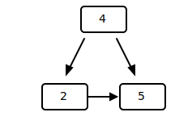
<p>
$T'=(v_{4},\lbrace v_{2},v_{5}\rbrace )$

- $v_{2}=(2,\lbrace v_{5}\rbrace )$
- $v_{4}=(4,\lbrace v_{2},v_{5}\rbrace )$
- $v_{5}=(5,\lbrace \rbrace )$
</p>
<p style="clear:both;">
$T'$ ist **kein** Baum, da $v_{4}$ und $v_{2}$ ein gemeinsames Kind haben.
</p>
</div>

---

<h4>Begriffe:</h4>

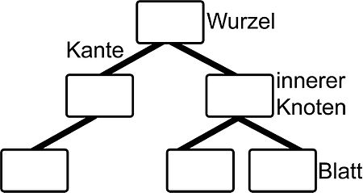<!--
  style ="display:block;
          margin:auto;"
-->

Ein **Pfad** folgt über **Kanten** zu verbundenen **Knoten**, dabei existiert zu jedem Knoten genau ein Pfad von der **Wurzel**. Ein Baum ist immer *zusammenhängend* und *zyklenfrei*.

<br><br>

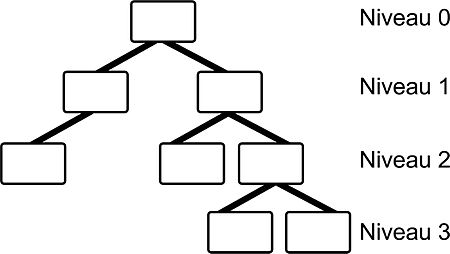<!--
  style ="display:block;
          margin:auto;"
-->

Das **Niveau** der jeweiligen Ebene entspricht immer der jeweiligen **Länge des Pfades**. Die Höhe eines Baumes entspricht dem größten Niveau + 1.

---

<h4>Anwendungen:</h4>

Man benutzt Bäume beispielsweise zur Darstellung von Hierarchien, wie Taxonomien, oder für Entscheidungsbäume. Bäume werden oft genutzt um sortierte, dynamische oder lineare Datenstrukturen zu repräsentieren, da Einfüge- und Löschoperationen leicht so definiert werden können, dass die Sortierung beibehalten wird. Ein Baum kann auch als Datenindex genutzt werden und stellt so eine Alternative zu Listen und Arrays dar.

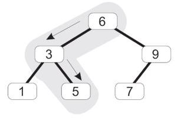<!--
  style ="display:block;
          margin:auto;"
-->

Hier wird beispielsweise nach der 5 gesucht und der Baum wird als *Suchbaum* genutzt.

Man kann auch einen Baum aus *Termen* bilden. Der Term $(3+4) * 5 + 2 * 3$ ergibt folgenden Baum:

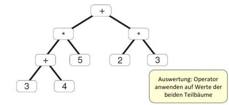<!--
  style ="display:block;
          margin:auto;"
-->

---

<h4>Atomare Operationen auf Bäumen:</h4>

Zu den Operationen zählen **lesen** mit

- $root()$: Wurzelknoten eines Baums
- $get(e)$: Wert eines Baumelements $e$
- $children(e)$: Kinderknoten eines Elements $e$
- $parent(e)$: Elternknoten eines Elements $e$

und **schreiben** mit

- $set(e,v)$: Wert des Elements $e$ auf $v$ setzen
- $addChild(e,e’)$: Füge Element $e’$ als Kind von $e$ ein (falls geordneter Baum nutze $addChild(e,e’,i)$ für Index $i$)
- $del(e)$: Lösche Element $e$ (nur wenn $e$ keine Kinder hat)

---

<h4>Spezialfall: Binärer Baum als Datentyp:</h4>

``` java

  class TreeNode<K extends Comparable<K>> {

    K key;
    TreeNode<K> left = null;
    TreeNode<K> right = null;

    public TreeNode(K e) {key = e;}
    public TreeNode<K> getLeft() {return left;}
    public TreeNode<K> getRight()  {return right;}
    public K getKey() {return key;}

    public void setLeft(TreeNode<K> n) {left = n;}
    public void setRight(TreeNode<K> n) {right = n;}

    ...

  }

```
<h5>Beispiel:</h5>

``` java
  TreeNode<Character> root = new TreeNode<Character>(‘A‘);
  TreeNode<Character> node1 = new TreeNode<Character>(‘B‘);
  TreeNode<Character> node2 = new TreeNode<Character>(‘C‘);
  TreeNode<Character> node3 = new TreeNode<Character>(‘D‘);

  root.setLeft(node1);
  root.setRight(node2);
  node2.setLeft(node3);
```

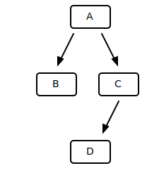<!--
  style ="display:block;
          margin:auto;"
-->

---

<h4>Typische Problemstellungen</h4>

Als typische Problemstellungen haben wir zum einen die Traversierung, zum Anderen das Löschen eines inneren Knotens und die daraus folgende Re-strukturierung des Baumes und das Suchen in Bäumen.

---

<h4>Bäume in Java</h4>

In Java gibt es keine hauseigene Implementierung für allgemeine Bäume. Einige Klassen *(TreeMap, TreeSet)* benutzen Bäume zur Realisierung anderer Datenstrukturen. Andere Klassen *(JTree)* benutzen Bäume als Datenmodell zur Visualisierung.


#### Traversierung

Bäume können visuell gut dargestellt werden. Manchmal ist jedoch eine Serialisierung der Elemente eines Baumes nötig. Man kann die Elemente eines Baumes durch *Preorder-Aufzählung*, *Inorder-Aufzählung*, *Postorder-Aufzählung* oder *Levelorder-Aufzählung* eindeutig aufzählen.

> Bei der **Traversierung** werden systematisch **alle Knoten** des Baumes durchlaufen.

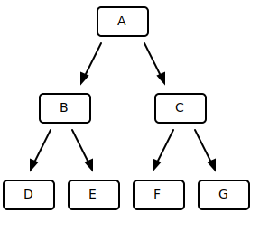<!--
  style ="display:block;
          margin:auto;"
-->

> **Preorder (W-L-R):** $A\to B\to D\to E\to C\to F\to G$
>
> **Inorder (L-W-R):** $D\to B\to E\to A\to F\to C\to G$
>
> **Postorder (L-R-W):** $D\to E\to B\to F\to G\to C\to A$
>
> **Levelorder:** $A\to B\to C\to D\to E\to F\to G$

---

<h4>Traversierung mit Iteratoren</h4>

Bei der Traversierung sind Iteratoren erlaubt. Diese werden schrittweise abgearbeitet und es werden Standardschleifen für die Baumdurchläufe verwendet.

``` Java
  for (Integer i : tree) {
    System.out.print(i);
  }
```

Dabei ist es allerdings notwendig, dass der Bearbeitungszustand zwischengespeichert wird.


``` Java
  public class BinarySearchTree<K extends Comparable<K>> implements Iterable<K> {

    public static final int INORDER = 1;  
    public static final int PREORDER = 2;
    public static final int POSTORDER = 3;
    public static final int LEVELORDER = 4;

    private int iteratorOrder;
    ...

    public void setIterationOrder(int io) {
      if (io < i || io > 4) {
        return;
      }
      iteratorOrder = io;
    }

    public Iterator<K> iterator() {
      switch (iterationOrder) {
       case INORDER:
        return new InorderIterator<K>(this);
       case PRORDER:
        return new PreorderIterator<K>(this);
       case POSTORDER:
        return new PostorderIterator<K>(this);
       case LEVELORDER:
        return new LevelorderIterator<K>(this);
       default:
        return new InorderIterator<K>(this);
      }
    }
  }
```

---

<h4>Preorder Traversierung</h4>

Bei der Preorder Traversierung wird der aktuelle Knoten zuerst behandelt und dann der linke oder rechte Teilbaum.

``` Java
  static class TreeNode<K extends Comparable<K>> {
  ...

    public void traverse() {
      if (key==null) {
        return;
      }
      System.out.print(” ” + key);
      left.traverse();
      right.traverse();
    }  
  }
```

---

<h4>Preorder Iteratoren</h4>

Der Wurzelknoten wird auf den Stack gelegt, anschließend der rechte Knoten und dann der linke Knoten.

``` Java
  class PreorderIterator<K extends Comparable <K>> implements Iterator<K> {

    java.util.Stack<TreeNode<K>> st = new java.util.Stack<TreeNode<K>>();

    public PreorderIterator(BinarySearchTree<K> tree) {
      if (tree.head.getRight() != nullNode) {
        st.push(tree.head.getRight());
      }   
    }

    public boolean hasNext() {
      return !st.isEmpty();
    }

    public K next() {
      TreeNode<K> node = st.pop();
      K obj = node.getKey();
      node = node.getRight();
      if(node != nullNode) {
         st.push(node);  //rechten Knoten auf den Stack
      }
      node = node.getLeft();
      if(node != nullNode) {
         st.push(node);  //linken Knoten auf den Stack
      }
      return obj;
    }
  }
```

---

<h4>Inorder Traversierung</h4>

Bei der Inorder Traversierung wird zuerst der linke Teilbaum behandelt, dann der aktuelle Knoten und dann der rechte Teilbaum. Als Ergebnis erhält man den Baum in sortierter Reihenfolge.

``` Java
  static class TreeNode<K extends Comparable<K>> {
    ...
    public void traverse() {
      if (key==null) {
          return;
      }
      left.traverse();
      System.out.print(” ” + key);
      right.traverse();
    }   
  }
```

---

<h4>Inorder Iteratoren</h4>

Der Knoten head hat immer einen rechten Nachfolger. Es wird vom Wurzelknoten begonnen alle linken Knoten auf den Stack zu legen.

``` Java
  class InorderIterator<K extends Comparable <K>> implements Iterator<K> {

    java.util.Stack<TreeNode<K>> st = new java.util.Stack<TreeNode<K>>();

    public InorderIterator(BinarySearchTree<K> tree) {
      TreeNode<K> node = tree.head.getRight();
      while (node != nullNode) {
        st.push(node);
        node = node.getLeft();
      }
    }

    public boolean hasNext() {
      return !st.isEmpty();
    }

    public K next() {
      TreeNode<K> node = st.pop();
      K obj = node.getKey();
      node = node.getRight();  //rechten Knoten holen
      while (node != nullNode) {
        st.push(node);
        node = node.getLeft();  //linken Knoten auf den Stack
      }
      return obj;
    }
  }
```

---

<h4>Postorder Traversierung</h4>

Bei der Postorder Traversierung wird zuerst der linke und der rechte Teilbaum behandelt und dann der aktuelle Knoten. Dies kann beispielsweise genutzt werden, um einen Baum aus Termen, entsprechend der Priorität der Operatoren, auszuwerten.

``` Java
  static class TreeNode<K extends Comparable<K>> {
    ...
    public void traverse() {
      if (key==null) {
          return;
      }
      left.traverse();
      right.traverse();   
      System.out.print(” ” + key);
    }
  }
```

---

<h4>Levelorder Iteratoren</h4>

``` Java
  class LevelorderIterator<K extends Comparable <K>> implements Iterator<K> {

    //Wurzelknoten in die Warteschlange (queue) einfügen
    java.util.Queue<TreeNode<K>> q = new java.util.LinkedList<TreeNode<K>>();

    public LevelorderIterator(BinarySearchTree<K> tree) {
      TreeNode<K> node = tree.head.getRight();
      if (node != nullNode) {
        q.addLast(node);
      }
    }

    public K next() {
      TreeNode<K> node = q.getFirst();
      K obj = node.getKey();
      if (node.getLeft() != nullNode) {
        q.addLast(node.getLeft());
      }
      if (node.getRight() != nullNode) {
        q.addLast(node.getRight());
      }
      return obj;
    }
  }
```

### Grundlagenquiz

<iframe src="file:///C:/Users/rosse/Documents/Privat/TIB%20Job/BestPractice/Dynamische%20Datenstrukturen/docs/h5p/Grundlagenquiz.html?embed=true" width="1098" height="494" frameborder="0" allowfullscreen="allowfullscreen"></iframe>

---

<iframe src="https://raw.githubusercontent.com/TorroRosso46/LiaScript_DynamischeDatenstrukturen/docs/h5p/Grundlagenquiz.html?embed=true" width="100%" height="100%" frameborder="0" allowfullscreen="allowfullscreen"></iframe>

<iframe src="https://raw.githubusercontent.com/TorroRosso46/LiaScript_DynamischeDatenstrukturen/docs/h5p/Grundlagenquiz.h5p?embed=true" width="100%" height="100%" frameborder="0" allowfullscreen="allowfullscreen"></iframe>

<iframe src="https://cdn.jsdelivr.net/gh/TorroRosso46/LiaScript_DynamischeDatenstrukturen/docs/h5p/Grundlagenquiz.html?embed=true" width="100%" height="100%" frameborder="0" allowfullscreen="allowfullscreen"></iframe>

<iframe src="https://cdn.jsdelivr.net/gh/TorroRosso46/LiaScript_DynamischeDatenstrukturen/docs/h5p/Grundlagenquiz.h5p?embed=true" width="100%" height="100%" frameborder="0" allowfullscreen="allowfullscreen"></iframe>

<iframe src="https://github.com/TorroRosso46/LiaScript_DynamischeDatenstrukturen/tree/master/docs/h5p/Grundlagenquiz.html?embed=true" width="100%" height="100%" frameborder="0" allowfullscreen="allowfullscreen"></iframe>

<iframe src="https://github.com/TorroRosso46/LiaScript_DynamischeDatenstrukturen/tree/master/docs/h5p/Grundlagenquiz.h5p?embed=true" width="100%" height="100%" frameborder="0" allowfullscreen="allowfullscreen"></iframe>

## Bäume

In dem folgenden Kapitel werden wir Ihnen verschiedene Baumtypen vorstellen. Angefangen bei den **Binären Suchbäumen**, gefolgt von den **AVL-** und den **2-3-4-Bäumen**, bis hin zu den **Rot-Schwarz-Bäumen**.

### Binäre Suchbäume

Auf dieser Seite werden die [binären Suchbäume](https://de.wikipedia.org/wiki/Bin%C3%A4rer_Suchbaum) behandelt. Er ermöglicht einen schneller Zugriff auf Daten mit dem Aufwand O(log n) unter geeigneten Voraussetzungen. Des weiteren ermöglicht er effiziente Sortierung von Daten, durch Heapsort und effiziente Warteschlangen. Der binäre Suchbaum dient als Datenstruktur für kontextfreie Sprachen. In der Computergrafik sind Szenengraphen oft (Beinahe-)Bäume. Bei Informationssysteme dienen binäre Suchbäume zur Datenindizierung und Anfrageoptimierung.

---

<h4>Operationen</h4>

Auf Suchbäumen können die Operationen [Suchen von Elementen](#8), [Einfügen von Elementen](#9) und [Entfernen von Elementen](#10) angewandt werden, wobei letztere zwei voraussetzen, dass die Ordnung der Schlüssel erhalten bleibt.

#### Suchen

Ein binärer Suchbaum kann für viele Anwendungen eingesetzt werden.

Hier ist der Baum ein Datenindex und eine Alternative zu Listen und Arrays. Beispielsweise kann dieser Baum als Suchbaum verwendet werden und nach $5$ gesucht werden.

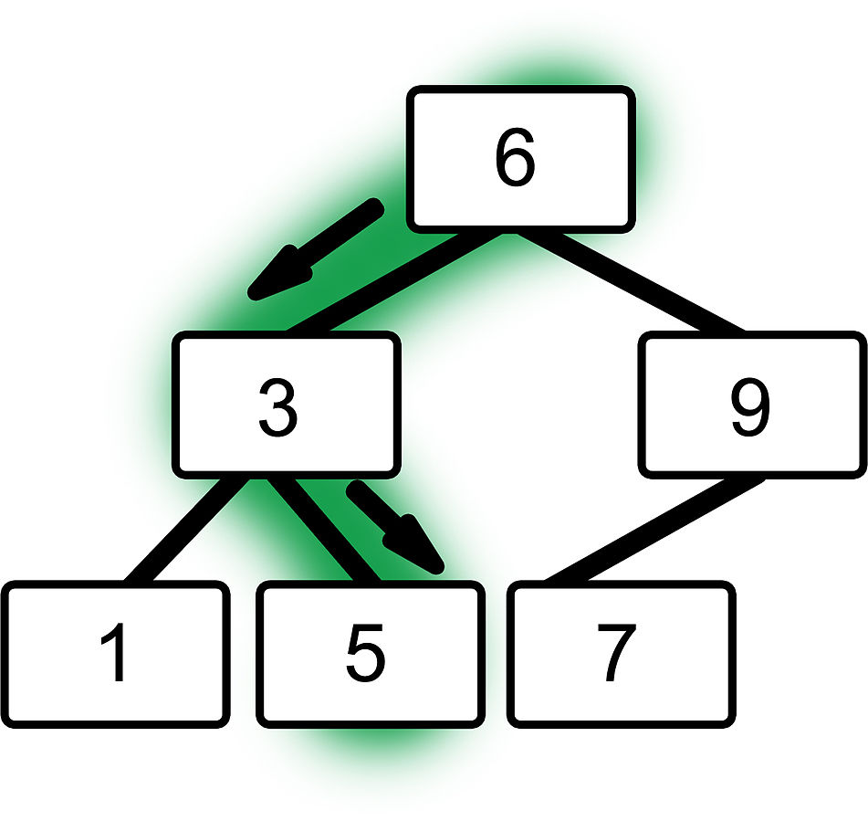<!--
  style ="display:block;
          margin:auto;"
-->

Bei der Anwendung von Bäumen zur effizienten Suche gibt es pro Knoten einen Schlüssel und ein Datenelement. Die Ordnung der Knoten erfolgt anhand der Schlüssel. Bei einem binärer Suchbaum enthält der Knoten $k$ einen Schlüsselwert $k.key$. Alle Schlüsselwerte im linken Teilbaum $k.left$ sind kleiner als $k.key$ und alle Schlüsselwerte im rechten Teilbaum $k.right$ sind größer als $k.key$. Die Auswertung eines Suchbaums sieht wie folgt aus:

> 1. Vergleich des Suchschlüssels mit Schlüssel der Wurzel
> 2. Wenn kleiner, dann in linken Teilbaum weiter suchen
> 3. Wenn größer, dann in rechtem Teilbaum weiter suchen
> 4. Sonst, gefunden oder nicht gefunden


``` java
static class  TreeNode<K extends Comparable<K>>{

  K key;
  TreeNode<K> left = null;
  TreeNode<K> right = null;

  public TreeNode(K e) {key = e;}
  public TreeNode<K> getLeft() {return left;}
  public TreeNode<K> getRight()  {return right;}
  public K getKey() {return key; }

  public void setLeft(TreeNode<K> n) {left = n;}
  public void setRight(TreeNode<K> n) {right = n;}

  ...
}     
```

---

<h4>Knotenvergleich</h4>

``` java
class  TreeNode<...> {
  ...

  public int compareKeyTo(K k) {
    return (key == null ? -1 : key.compareTo(k));
  }

  ...
}    
```

---

<h4>Rekursives Suchen</h4>

``` java
protected  TreeNode<K>recursiveFindNode(TreeNode<K>  n, k){
    /* k wird gesucht */

    if (n!= nullNode) {
      int cmp = n.compareKeyTo(k.key);
      if (cmp == 0) {
        return n;
      } else if (cmp > 0) {
        return recursiveFindNode(n.getLeft(),k);
      } else {
        return recursiveFindNode(n.getRight(),k);
      }
    }
    else {
      return null;
    }
}
```

---

<h4>Iteratives Suchen</h4>

``` java
protected  TreeNode<K> iterativeFindNode(TreeNode<K> k){
  /* k wird gesucht */

  TreeNode<K> n = head.getRight();
  while (n != nullNode) {
    int cmp = n.compareKeyTo(k.key);
    if (cmp == 0) {
      return n;
    } else {
      n = (cmp > 0 ? n.getLeft() : n.getRight());
    }
  }
  return null;
}
```

---

<h4>Suchen des kleinsten Elements</h4>

``` java
protected K findMinElement(){
  TreeNode<K> n = head.getRight();
  while (n.getLeft() != nullNode) {
    n = n.getLeft();
  }
  return n.getKey();
}
```

---

<h4>Suchen des größten Elements</h4>

``` java
protected K findMaxElement(){
  TreeNode<K> n = head.getRight();
  while (n.getRight() != nullNode) {
    n = n.getRight();
  }
  return n.getKey();
}
```

---

<h4>Der Baum aus Termen</h4>

Eine weitere Anwendungsmöglichkeit ist der Baum aus Termen. Wir haben den Term $(3+4) * 5 + 2 * 3$, als Baumdarstellung sieht es so aus:

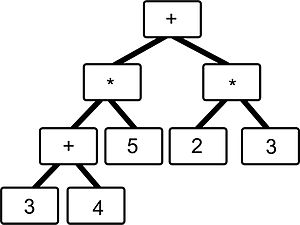<!--
  style ="display:block;
          margin:auto;"
-->

Bei der Auswertung müssen die Operatoren auf die beiden Werte der Teilbäume angewandt werden.

#### Einfügen

Das Finden der Einfügeposition erfolgt durch Suchen des Knotens, dessen Schlüsselwert größer als der einzufügende Schlüssel ist und der keinen linken Nachfolger hat oder durch Suchen des Knotens, dessen Schlüsselwert kleiner als der einzufügende Schlüssel ist und der keinen rechten Nachfolger hat. Das Einfügen erfolgt prinzipiell in 2 Schritten. Im **ersten Schritt** wird die Einfügeposition gesucht, sprich der Blattknoten mit dem nächstkleineren oder nächstgrößerem Schlüssel. Im **zweiten Schritt** wird ein neuer Knoten erzeugt und als Kindknoten des Knotens aus Schritt eins verlinkt. Wenn in Schritt eins der Schlüssel bereits existiert, dann wird nicht erneut eingefügt.

<h5>Programm in Java</h5>

``` java
/* Einfügeposition suchen */
public boolean  insert(K k) {

  TreeNode<K> parent = head;
  TreeNode<K> child = head.getRight();

  while (child != nullNode) {

    parent = child;
    int cmp = child.compareKeyTo(k);

    //Schlüssel bereits vorhanden
    if (cmp == 0) {
      return false;
    } else if (cmp > 0) {
      child = child.getLeft();
    } else {
      child = child.getRight();
    }

  }

  /* Neuen Knoten verlinken */  
  TreeNode<K> node = new TreeNode<K>(k);
  node.setLeft(nullNode);
  node.setRight(nullNode);

  if (parent.compareKeyTo(k) > 0) {
    parent.setLeft(node);
  } else {
    parent.setRight(node);
  }

  return true;

}
```

#### Löschen

Zuerst wird das zu löschendes Element gesucht, der Knoten $k$. Nun gibt es **drei** Fälle

  1. $k$ ist Blatt: löschen
  2. $k$ hat ein Kind: Kind „hochziehen“
  3. $k$ hat zwei Kinder: Tausche mit weitest links stehenden Kind des rechten Teilbaums, da dieser in der Sortierreihenfolge der nächste Knoten ist und entferne diesen nach den Regeln 1. oder 2.

Ein Schlüssel wird in drei Schritten gelöscht. Im ersten Schritt wird der zu löschende Knoten gefunden. Im zweiten Schritt wird der Nachrückknoten gefunden. Dafür gibt es mehrere Fälle. Im **Fall 1** handelt es sich um einen externen Knoten, sprich ein Blatt, ohne Kinder. Dabei wird der Knoten durch einen nullNode ersetzt. Im **Fall 2a** gibt es nur einen rechten Kindknoten, dabei wird der gelöschte Knoten durch den rechten Kindknoten ersetzt. Im **Fall 2b** gibt es nur einen linken Kindknoten und der gelöschte Knoten wird durch diesen ersetzt. Im **Fall 3** gibt es einen internen Knoten mit Kindern rechts und links. Dabei wird der gelöschte Knoten durch den Knoten mit dem kleinstem (alternativ größtem) Schlüssel im rechten (alternativ linken) Teilbaum ersetzt. Im dritten und letzten Schritt wird nun der Baum **reorganisiert**. Während dem Löschen kann sich die Höhe von Teilbäumen ändern.

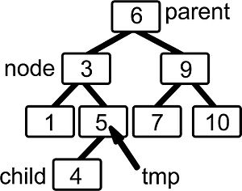<!--
  style ="display:block;
          margin:auto;"
-->

<h5>Programm in Java</h5>

``` java
/* Knoten suchen */
public boolean  remove(K k) {

  TreeNode<K> parent = head;
  TreeNode<K> node = head.getRight();
  TreeNode<K> child = null;
  TreeNode<K> tmp = null;

  while (node != nullNode) {

    int cmp = node.compareKeyTo(k);

    //Löschposition gefunden
    if (cmp == 0) {
      break;
    } else {
      parent = node;
      node = (cmp > 0 ? node.getLeft() : node.getRight());
    }

  }

  //Knoten k nicht im Baum
  if (node == nullNode) {
    return false;
  }

  /* Nachrücker finden */
  if (node.getLeft() == nullNode  && Node.getRight() == nullNode) { //Fall 1

    child = nullNode;

  } else if (node.getLeft() == nullNode) { //Fall 2a

    child = node.getRight();

  } else if (node.getRight() == nullNode) { //Fall 2b

    child = node.getLight();
    ...

  } else { //Fall 3

    child = node.getRight();
    tmp = node;

    while (child.getLeft() != nullNode) {
      tmp = child;
      child = child.getLeft();
    }

    child.setLeft(node.getLeft());

    if (tmp != node) {
      tmp.setLeft(child.getRight());
      child.setRight(node.getRight());
    }

  }

  /* Baum reorganisieren */
  if (parent.getLeft() == node) {
    parent.setLeft(child)
  } else {
    parent.setRight(child);
  }

  return true;
  ...

}
```

#### Implementierung

Ein binärer Suchbaum ist eine häufig verwendete Hauptspeicherstruktur und ist besonders geeignet für Schlüssel fester Größe, z.B. numerische wie *int*, *float* und *char[n]*. Der Aufwand von $O(log n)$ für Suchen, Einfügen und Löschen ist garantiert, vorausgesetzt der Baum ist **balanciert**. Später werden wir lernen, dass die Gewährleistung der Balancierung durch spezielle Algorithmen gesichert wird. Des weiteren sind größere, angepasste Knoten für Sekundärspeicher günstiger, diese nennt man B-Bäume. Für Zeichenketten benutzt man als Schlüssel variable Schlüsselgrößen, sogenannte Tries.

``` java
public class BinarySearchTree<K extends Comparable<K>> implements Iterable<K> {

  ...

  static class TreeNode<K extends Comparable<K>> {

    K key;
    TreeNode<K> left = null;
    TreeNode<K> right = null;

    ...

  }
}
```

Die Schlüssel müssen das **Comparable-Interface**, d.h. die *compareTo()-Methode*, implementieren, da der Suchbaum auf Vergleichen der Schlüssel basiert. Der Baum selbst implementiert das **Iterable-Interface**, d.h. die *iterator()-Methode*, um Traversierung des Baums über einen Iterator zu erlauben (später Baumtraversierung). *TreeNode* und alles weitere werden als innere Klassen implementiert. Dadurch werden Zugriffe auf Attribute und Methoden der Baumklasse erlaubt. Eine Besonderheit der Implementierung sind die „leeren“ **Pseudoknoten** *head* und *nullNode* zur Vereinfachung der Algorithmen (manchmal „Wächter“ / „sentinel“ genannt). Grundlegende Algorithmen sind:

- Suchen
- Einfügen
- Löschen

---

<h4>Implementierung mit Pseudoknoten</h4>

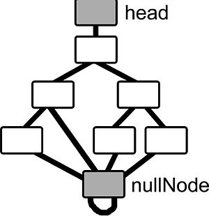<!--
  style ="display:block;
          margin:auto;"
-->

Wir vereinbaren an dieser Stelle, dass man auf dem *head* kein *getRight()* anwenden kann.

``` java
public class BinarySearchTree<K extends Comparable<K>> implements Iterable<K> {

  ...

  pulic BinarySearchTree() {

    head = new TreeNode<K>(null);
    nullNode = new TreeNode<K>(null);

    nullNode.setLeft(nullNode);
    nullNode.setRight(nullNode);
    head.setRight(nullNode);

  }

  ...
}
```

Das Ziel der Implementierung ist, die Reduzierung der Zahl an Sonderfällen. Im *head* würde das Einfügen oder Löschen des Wurzelknotens spezielle Behandlung in der Baum-Klasse erfordern. Der *nullNode* erspart den Test, ob zum linken oder zum rechten Teilknoten navigiert werden kann. Des weiteren ist im *nullNode* ein einfaches Beenden der Navigation (z.B. Beenden der Rekursion) möglich.

#### Weitere Aspekte

---

<h4>Komplexität</h4>

Die Komplexität der Operation hängt von der Höhe ab. Der Aufwand für die Höhe des Baumes beträgt $O(h)$. Die Höhe eines ausgeglichenen binären Baumes ist $h=ld(n)$ für Knoten. Bei einem ausgeglichenen oder balancierten Baum unterscheiden sich zum einen der rechte und linke Teilbaum eines jeden Knotens in der Höhe um höchstens $1$ und zum anderen unterscheiden sich je zwei Wege von der Wurzel zu einem Blattknoten höchstens um $1$ in der Länge. Rot-Schwarz Bäume und AVL Bäume benötigen einen Ausgleich nach dem Einfügen und Löschen.

---

<h4>Entartung von Bäumen</h4>

Eine ungünstige Einfüge- oder Löschreihenfolge führt zu extremer Unbalanciertheit im Baum. Im Extremfall wird der Baum zur Liste, dann haben die Operationen eine Komplexität von $O(n)$. Beispiel:

``` Java
for (int i = 0; i < 10; i++) {
  tree.insert(i);
}
```

Vermeiden kann man dies durch spezielle Algorithmen zum Einfügen und Löschen, z.B. mit Rot-Schwarz-Bäumen und AVL-Bäumen.

### AVL-Bäume

Auf dieser Seite werden [AVL Bäume](https://de.wikipedia.org/wiki/AVL-Baum) behandelt. Ein Suchbaum erfordert nach Einfügen oder Löschen von Knoten einen Ausgleich, da sie sonst entarten. **AVL** steht für die russischen Mathematiker Adelson-Velskii und Landis. Liegt ein binärer Suchbaum mit AVL Kriterium vor, bedeutet das, dass für jeden inneren Knoten gilt: Die Höhe des linken und rechten Teilbaums differieren maximal um **1**. Es reicht nicht diese Bedingung nur für die Wurzel zu fordern, da beide Teilbäume der Wurzel entartet sein könnten.

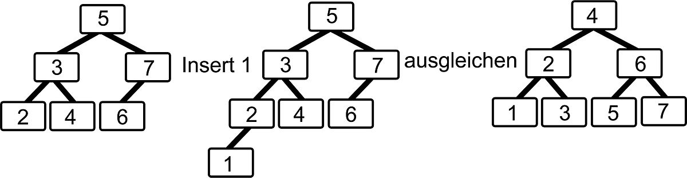<!--
style = "display:block;
         margin:auto;"
-->

Als Lösungsidee gibt es zwei Ansätze. Zum einen ein abgeschwächtes Kriterium für die ausgeglichene Höhe, beispielsweise AVL Bäume und zum anderen eine ausgeglichene Höhe, aber ein unausgeglichener Verzweigungsgrad. Dabei können wir eine direkte Realisierung als Mehrwegbäume, beispielsweise B-Bäume, nutzen, oder eine Kodierung als binären Baum, beispielsweise Rot-Schwarz-Bäume.

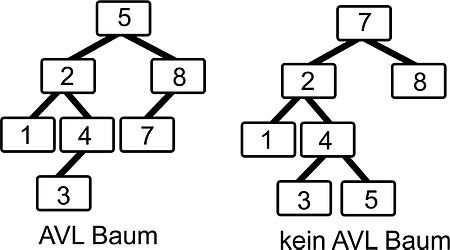<!--
style = "display:block;
         margin:auto;"
-->

---

<h4>Höhe von AVL-Bäumen</h4>

Wie viele Knoten $k_{min}$ hat ein AVL Baum der Höhe $h$ mindestens? Bei einer rekursiven Beziehung ist $k_{min}(0)=1$ , d.h der Baum hat nur eine Wurzel. Bei $k_{min}(1)=2$, das heißt der Baum hat nur einen Zweig und bei $k_{min}(2)=4$, das heißt der Baum hat mehr Zweige. Daraus lässt sich allgemein sagen, dass $k_{min}(n)=k_{min}(n-1)+k_{min}(n-2)+1$. Damit wächst der Baum vergleichbar mit der Fibonacci Reihe.

$k_{min}(h):=\left\{{\begin{array}{ll}1&h=1\\2&h=2\\k_{min}(h-1)+k_{min}(h-2)+1&h>2\end{array}}\right.$

$Fib(n):=\left\{{\begin{array}{ll}0&h=1\\1&h=1\\Fib(h-1)+Fib(h-2)&h>1\end{array}}\right.$

---

<h4>Einfügen in AVL-Bäumen</h4>

Das Einfügen eines Schlüssels erfolgt mit den üblichen Algorithmen. Es kann aber passieren, dass danach die AVL Eigenschaft verletzt ist. Die Balance ist definiert als ***left.height-right.height***. Als AVL Eigenschaft muss die Balance $\in \{-1,0,+1\}$ sein. Nach Einfügen ist die Balance aber $\in \{-2,-1,0,1,2\}$ Reparieren kann man das Ganze mittels Rotation und Doppelrotation.

<h5>Fallunterscheidung</h5>

Beim Einfügen kann man in verschiedene Fälle unterteilen. Eine Verletzung der AVL Eigenschaft tritt ein bei

> 1. Einfügen in linken Teilbaum des linken Kindes
> 2. Einfügen in rechten Teilbaum des linken Kindes
> 3. Einfügen in linken Teilbaum des rechten Kindes
> 4. Einfügen in rechten Teilbaum des rechten Kindes

**1** und **4** sowie **2** und **3** sind symmetrische Problemfälle.

---

<h4>Einfache Rotation</h4>

Wir haben eine Rotation mit linkem Kind nach rechts oder rechtem Kind nach links.

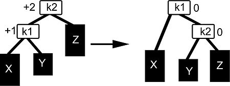<!--
style = "display:block;
         margin:auto;"
-->

---

<h4>Doppelrotation</h4>

Wir haben eine Doppelrotation mit linkem Kind nach rechts oder rechtem Kind nach links.

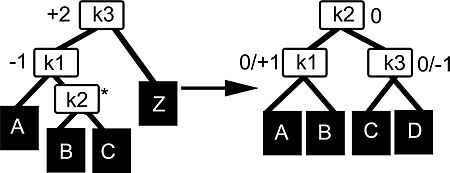<!--
style = "display:block;
         margin:auto;"
-->

---

<h4>Beispiel</h4>

Im Folgenden werden wir die Rotation an einem Beispiel veranschaulichen:

> - insert 3, 2, 1
>
>   → einfache Rotation nach rechts (2,3)
>
> - insert 4, 5
>
>   → einfache Rotation nach links (4,3)
>
> - insert 6
>
>   → einfache Rotation (Wurzel) nach links (4,2)
>
> - insert 7
>
>   → einfache Rotation nach links (6,5)
>
> - insert 16, 15
>
>   → Doppelrotation nach links (7,15,15)
>
> - insert 13+12+11+10
>
>   → jeweils einfache Rotation
>
> - insert 8, 9
>
>   → Doppelrotation nach rechts

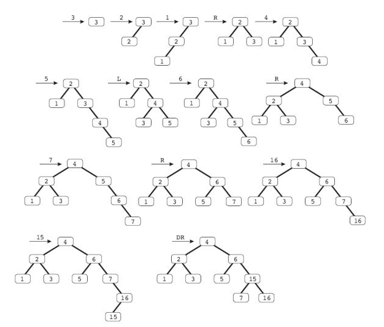<!--
style = "display:block;
         margin:auto;
         width:100%;"
-->

Eine **Verletzung der AVL-Eigenschaft** tritt ein

1. Beim Einfügen in linken Teilbaum des linken Kindes, dann muss eine Rotation mit dem linkem Kind erfolgen
2. Beim Einfügen in rechten Teilbaum des linken Kindes, dann muss eine Doppelrotation mit dem linken Kind erfolgen
3. Beim Einfügen in linken Teilbaum des rechten Kindes, dann muss eine Doppelrotation mit dem rechten Kind erfolgen
4. Beim Einfügen in rechten Teilbaum des rechten Kindes, dann muss eine Rotation mit dem rechten Kind erfolgen

---

<h4>Implementation</h4>

Die Implementierung ist ähnlich des binären Suchbaums. Der Aufruf um einen neuen Knoten hinzuzufügen geschieht dabei mit ***AvlTree.insert(K k)***.

``` java
public class AvlTree<K extends Comparable<K>> {

  private AvlTreeNode<K> head;
  private AvlTreeNode<K> nullNode; //Neuer Knotentyp

  public AvlTree() {
    head = new AvlTreeNode<K>(null);
    nullNode = new AvlTreeNode<K>(null);

    nullNode.setLeft(nullNode);
    nullNode.setRight(nullNode);
    head.setRight(nullNode);
  }

  public boolean insert(K k){
    AvlTreeNode<K> parent = head;
    AvlTreeNode<K> child = head.getRight();

    while(child != nullNode) {
      parent = child;
      int cmp = child.getKey().compareTo(k);

      if(cmp == 0) {
        return false;
      } else if (cmp > 0) {
        child = child.getLeft();
      } else {
        child = child.getRight();
      }

    }

    AvlTreeNode<K> node = new AvlTreeNode<K>(k);
    node.setLeft(nullNode);
    node.setRight(nullNode);
    node.setParent(parent);

    if(parent.compareTo(node) > 0) {
       parent.setLeft(node);
    } else {
       parent.setRight(node);
    }

    //Nach der Einfügung die Balance ggfs. reparieren
    parent.repair(node, nullNode);
    return true;

  }
}
```

Die Knotenimplementierung ist zu Beginn genauso wie beim binären Suchbaum. Die Methoden ***balance()*** und ***height()*** dienen als Hilfe für die Balance. Weiterhin wird die Methode ***repair()*** zur Reparatur der Balance benötigt. Sie testet, ob die Balance für den aktuellen Knoten ***(this)*** verletzt ist und repariert diese gegebenenfalls.

``` java
class AvlTreeNode<K extends Comparable<K>> {

  K key;
  private AvlTreeNode<K> left;
  private AvlTreeNode<K> right;
  private AvlTreeNode<K> parent;  //für jeden Knoten merken wir uns nun den Elternknoten

  public AvlTreeNode(K key){
    this.left = null;
    this.right = null;
    this.parents = null;
    this.key = key;
  }

  public AvlTreeNode<K> getLeft() { return left; }
  public AvlTreeNode<K> getRight() { return right; }
  public K getKey() { return key; }
  public void setLeft(AvlTreeNode<K> n) { left = n; }
  public void setRight(AvlTreeNode<K> n) { right = n; }
  public void setParent(AvlTreeNode<K> n) { parent = n; }

  public int compareTo(AvlTreeNode<K> other) {
    return (this.key == null) ? -1 : this.key.compareTo(other.key);
  }

  //Positive Balance, falls linker Teilbaum größer als der rechte Teilbaum
  //Negative Balance, falls rechter Teilbaum größer als der linke Teilbaum
  //Balance = 0, falls ausgeglichen
  public int balance() {

    if(this.key == null) { //Nullknoten sind stets ausgeglichen
       return 0;
    }

    return this.left.height() - this.right.height();

  }

  //Gibt die Länge des längsten Pfades zu einem Blatt wieder
  public int height() {

    if(this.key == null) { //Nullknoten haben die Höhe 0
      return 0;
    }

    return Math.max(this.left.height(), this.right.height()) + 1;
  }

  //Es werden die zwei nachfolgenden Knoten auf dem Pfad der Einfügung übergeben
  //man startet vom Punkt der Einfügung, einem Blatt und arbeitet sich von unten nach oben
  public void repair(AvlTreeNode<K> child, AvlTreeNode<K> grandchild){
    //Falls wie am head angekommen sind, terminieren wir
    if(this.key == null) {
      return;
    }

    //Fall 1: Einfügen im linken Teilbaum des linken Kindes
    if(this.balance() > 1 && child.balance() > 0) {
       child.parent = this.parent;
       this.parent = child;
       this.left = child.right;
       child.right = this;

       if(child.parent.left == this) {
         child.parent.left = child;
       } else {
         child.parent.right = child;
       }

    }

    //Fall 2: Einfügung im rechten Teilbaum des linken Kindes
    if(this.balance() > 1 && child.balance() < 0){
      grandchild.parent = this.parent;
      this.parent = grandchild;
      this.left = grandchild.right;
      this.left.parent = this;
      grandchild.right = this;
      child.right = grandchild.left;
      child.right.parent = child;
      grandchild.left = child;
      child.parent = grandchild;

      if(grandchild.parent.left == this) {
        grandchild.parent.left = grandchild;
      } else {
        grandchild.parent.right = grandchild;
      }
    }

    //Fall 3 und 4 wären analog
    //Fahre rekursiv mit Elternknoten fort
    this.parent.repair(this, child);
  }
}
```

### 2-3-4-Bäume

Auf dieser Seite werden die  [2-3-4-Bäume](https://de.wikipedia.org/wiki/2-3-4-Baum) behandelt. Die Idee ist ein **ausgeglichener Baum** mit **variablem Verzweigungsgrad**. Die Ausgeglichenheit wird bei der Einfügeoperation gewährleistet und die Implementierung erfolgt durch Binärbäume.

Neben binären Knoten (2-Knoten) haben wir nun auch 3-Knoten und 4-Knoten.

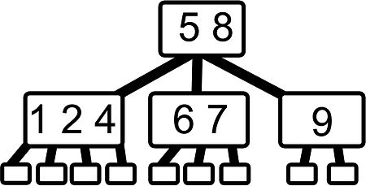<!--
style = "display:block;
         margin:auto;"
-->

---

<h4>Operationen</h4>

Die **Suche** in 2-3-4 Bäumen erfolgt analog zu binären Suchbäumen. Beim **Einfügen** liefert eine erfolglose Suche den Blattknoten $b$. Ist $b$ ein **2-** oder **3-Knoten** wird eingefügt. Aber ist $b$ ein **4-Knoten** dann wird aufgeteilt *(split)* und das mittlere Element nach oben gezogen. Das Splitten kann sich bis zur Wurzel fortpflanzen *(bottom-up)*.

### Rot-Schwarz-Bäume

Auf dieser Seite werden die [Rot-Schwarz Bäume](https://de.wikipedia.org/wiki/Rot-Schwarz-Baum) (auch RS Bäume oder RB Bäume (englisch *"red-black tree"*) genannt) behandelt. Die Idee ist wie bei den 2-3-4 Bäumen ein ausgeglichener Baum mit variablem Verzweigungsgrad. Die Ausgeglichenheit wird bei der Einfügeoperation gewährleistet und die Implementierung erfolgt durch Binärbäume.

---

<h4>Binäre Repräsentation von 2-3-4 Bäumen als Rot-Schwarz Baum</h4>

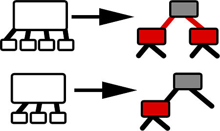<!--
style = "display:block;
         margin:auto;
         width:100%;"
-->

Rot-Schwarz-Bäume sind binäre Suchbäume. Jeder Knoten ist entweder rot oder schwarz. Der Wurzelknoten (Null-Knoten) ist per Definition schwarz. Die Kinder jedes roten Knotens sind schwarz. Für jeden Knoten $k$ gilt, dass jeder Pfad von $k$ zu einem Blatt die gleiche Anzahl schwarze Knoten enthält.

---

<h4>Einfügen in RB Bäume</h4>

Zuerst erfolgt **top-down** ein Splitten (nicht-rekursiv) der 4er-Knoten. Dann wird in zwei Hauptfälle unterschieden. Im **Fall 1** hängt der 4er-Knoten an einem 2er-Knoten und im **Fall 2** hängt der 4er-Knoten an einem 3er-Knoten. Hierbei gibt es noch Unterfälle. Bei **Fall 2A** hängt der Teilbaum links oder rechts. Bei **Fall 2B** hängt der Teilbaum in der Mitte.

**Das Splitten im RB Baum bei Fall 1**

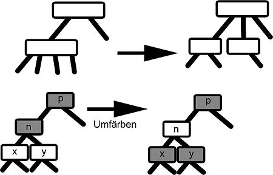<!--
style = "display:block;
         margin:auto;
         width:100%;"
-->

**Das Splitten im RB Baum bei Fall 2a**

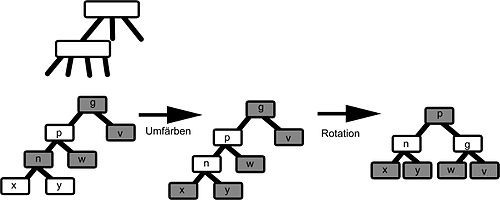<!--
style = "display:block;
         margin:auto;
         width:100%;"
-->

**Das Splitten im RB Baum bei Fall 2b**

<!--
style = "display:block;
         margin:auto;
         width:100%;"
-->

**Beispiel Einfügen der Zahl 13**

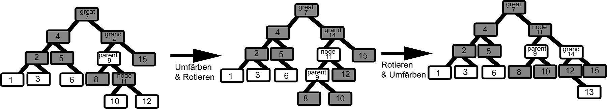<!--
style = "display:block;
         margin:auto;
         width:100%;"
-->

Zuerst wird die Einfügeposition gesucht. Die Knoten mit 2 roten Kindern (4-Knoten) werden auf dem Weg präventiv gesplittet. Anschließend wird ein neuer Knoten auf Blattebene erzeugt. Nun wird die Balance wieder hergestellt durch *Split* und *Rotation*.

---

<h4>Implementierung RB Baum</h4>

Die Datenstruktur ist weitgehend identisch mit einem „normalem“ Binärbaum. Das Balance-Kriterium besagt, dass die Anzahl schwarzer Knoten auf dem Weg von jedem Blatt zur Wurzel gleich sein muss. Außerdem hat jeder schwarze Knoten 0, 1 oder 2 rote oder schwarze Kindknoten. Des weiteren kann jeder rote Knoten nur schwarze Kindknoten haben.

Die im Folgenden vorgestellte Implementierung eines binären Suchbaumes wurde abgewandelt.

- Die Klasse **TreeNode** wird zu **RBNode** abgewandelt.
- Hinzufügen des booleschen Attributs **red**
- Keine generische Implementierung hier, d.h. **java.lang.Object** wird als Typ des Schlüssels verwendet
- Pseudoknoten **head** und **nullNode**
- Innere Klasse für Knoten

``` java
public class RedBlackTree {

  static class RBNode {

    Object key;
    RBNode left = null, right = null;
    boolean red = false;
    ...
  }

  private RBNode head, nullNode;
  ...

}
```

---

<h4>Einfügeposition</h4>

Nach der Initialisierung wird *grand* ein Niveau tiefer gesetzt. Wenn der Knoten schon enthalten ist, wird ein *false* zurückgegeben. Ansonsten wird die Einfügeposition gesucht. In der **If** Anweisung werden präventiv die 4er Knoten aufgesplittet.

``` java
public boolean insert (Compareable c) {

  RBNode node, great, grand, parent;
  int cmp = 0;
  node = parent = grand = great = head;

  while (node != nullNode) {
    great = grand; grand = parent; parent = node;
    cmp = node.getKey.compareKeyTo (c);

    if (cmp == 0) {
      return false;
    } else {
      node = cmp > 0 ? node.getLeft () : node.getRight ();
    }

    if (node.getLeft().isRed() && node.getRight().isRed()) {
      split (c, node, parent, grand, great);
    }
  }
}
```

---

<h4>Neuen Knoten einfügen und Balancieren</h4>

Der neue Knoten wird als linker oder rechter Knoten eingefügt. Eingefügte Knoten werden als Teil eines 4er Knoten angenommen.

``` java
public boolean insert (Compareable c) {

  ...

  node = new RBNode (c);
  node.setLeft (nullNode); node.setRight(nullNode);

  if (parent.compareKeyTo(c) > 0) {
    parent.setLeft(node);
  } else {
    parent.setRight(node);
  }

  split(c, node, parent, grand, great);
  return true;
}
```

**Der Splitvorgang**

Zuerst werden die Knoten umgefärbt (Fall 1), dann wird überprüft, ob der Elternknoten ein 3er Knoten ist und ob der aktuelle Knoten und der Elternknoten gleich orientiert sind. Anschließend wird Fall 2b in Fall 2a überführt. Zum Schluss wird der geteilte Knoten umgefärbt.

``` java
private void split (Compare c, RBNode node, RBNode parent, RBNode grand, RBNode great) {
  node.setRed(true);
  node.getLeft().setRed(false);
  node.getRight().setRed(false);

  if (parent.isRed()) {
    grand.setRed(true);

    if (grand.compareKeyTo (c)!= parent.compareKeyTo (c)) {
      parent = rotate (c, grand);
    }

    node = rotate(c, great);
    node.setRed(false);
  }

  head.getRight().setRed(false);
}
```

**Der Rotiervorgang**

Zuerst wird der Nachfolgerknoten bestimmt, und eine Rotation findet rechts oder links herum statt. Zum Schluss wird die Rotation in node eingehängt.

``` java
private RBNode rotate(Comparable c, RBNode node) {
  RBNode child, gchild;
  child = node.compareKeyTo (c) > 0 ? node.getLeft (): node.getRight();

  if (child.getKey().compareKeyTo (c) > 0) {
    gchild = child, getLeft();
    child.setLeft(gchild.getRight());
    gchild.setRight(child);
  } else {
    gchild = child.getRight();
    child.setRight(gchild.getLeft());
    gchild.setLeft(child);
  }

  if (node.getKey().compareKeyTo(c) > 0) {
    node.setLeft(gchild);
  } else {
    node.setRight(gchild);
  }

  return gchild;
}
```

## Heaps

Auf dieser Seite wird das Thema [Heap Sort](https://de.wikipedia.org/wiki/Heap_Sort) behandelt. Von **"Heap"** gibt es zwei völlig verschiedene Definitionen. Zum einen ist es ein größeres Gebiet im Hauptspeicher, aus dem Programmierer Blöcke beanspruchen und wieder freigeben können und zum anderen ist es ein **balancierter**, **linksbündiger Binärbaum in dem kein Knoten einen Wert hat**, der größer ist als der Wert seines Elternknoten. Im Falle von Heapsort wird die zweite Definition benutzt.

---

<h4>Balancierter Binärbaum</h4>

Jeder Knoten ist in einer Ebene platziert, der Wurzelknoten in Ebene 0. Die Höhe eines Baumes ist die Distanz von seiner Wurzel zum weitest entfernten Knoten plus 1. Ein Knoten ist tiefer als ein anderer Knoten, wenn seine Ebene eine höhere Zahl hat. Ein Binärbaum der Höhe h ist balanciert, wenn alle Knoten der Ebenen 0 bis h-3 zwei Kinder haben.

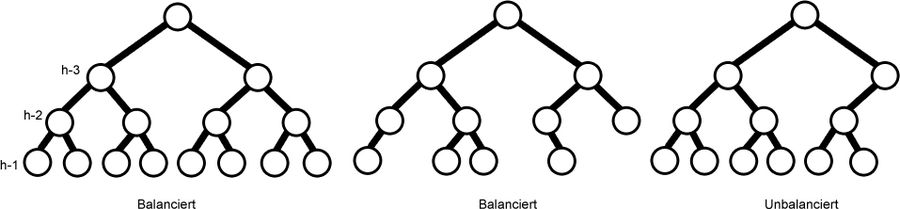<!--
style = "display:block;
         margin:auto;"
-->

Ein balancierter Binärbaum der Höhe $h$ ist linksbündig, wenn er $2^{k}$ Knoten in der Ebene $k$ hat für alle $k<h-1$ und alle Blätter der Ebene $h-1$ so weit wie möglich links sind.

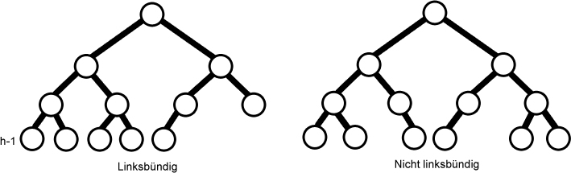<!--
style = "display:block;
         margin:auto;"
-->

---

<h4>Motivation</h4>

Der Vorteil von MergeSort gegenüber QuickSort ist, dass MergeSort einen garantierten Aufwand von $O(n * log * n)$ hat. Der Vorteil von QuickSort gegenüber MergeSort ist, dass QuickSort $n$ viel Speicher benötigt und MergeSort $2n$ viel Speicher. Gibt es nun einen Sortieralgorithmus, der $n$ viel Speicher benötigt und garantiert in $O(n * log * n)$ läuft? **Ja HeapSort!** Mit HeapSort lassen sich zudem die Warteschlangen mit Prioritäten effizient implementieren. Außerdem ist die Idee des Heaps sehr interessant. Eine komplexe Datenstruktur (Baum) wird in einer einfacheren Struktur (Array) abgebildet.

---

<h4>Heap Eigenschaft</h4>

Ein Knoten hat die Heap-Eigenschaft, wenn der Wert in dem Knoten so groß oder größer ist als die Werte seiner Kinder. Alle Blattknoten haben dann auch automatisch die Heap Eigenschaft. Ein Binärbaum ist nur dann ein Heap, wenn alle Knoten die Heap Eigenschaft besitzen.

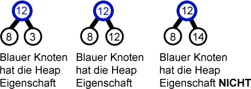<!--
style = "display:block;
         margin:auto;"
-->

---

<h4>Anmerkung</h4>

Ein Heap ist kein binärer Suchbaum. Das Sortierkriterium bei Suchbäumen war, dass der Wert eines Knotens stets größer ist, als die Werte der Knoten, die im linken Teilbaum liegen und, dass der Wert eines Knotens stets kleiner ist, als die Werte der Knoten, die im rechten Teilbaum liegen. Das **Sortierkriterium beim Heap** ist, dass die Werte eines Knotens stets größer oder gleich der Werte der Knoten sind, die in beiden Teilbäumen liegen.


## Hashtabellen

Auf dieser Seite wird das Thema Hashtabellen behandelt. Gesucht ist eine dynamische Datenstruktur mit **sehr schnellem direktem Zugriff** auf Elemente. Die Idee der Hashfunktion ist, dass ein Feld von **0 bis N-1** benutzt wird, beispielsweise ein Array. Die einzelnen Positionen im Feld werden oft als **Buckets** bezeichnet. Die Hashfunktion $h(e)$ bestimmt für Elemente $e$ die Position im Feld. $H(e)$ ist sehr schnell berechenbar. Es gilt $h(e) \neq$ wenn $e \neq e'$.

<h4>Beispiel</h4>

Wir haben ein Array von 0 bis 9 und $h(i)=i * mod * 10$. Das Array sieht nach dem Einfügen der Zahlen 42 und 119 wie folgt aus:

<!--
data-type="none"
data-transpose="true"
-->
| Index | Eintrag |
|:----- |:------- |
| 0     |         |
| 1     |         |
| 2     | 42      |
| 3     |         |
| 4     |         |
| 5     |         |
| 6     |         |
| 7     |         |
| 8     |         |
| 9     | 119     |

Der Vorteil von Hashing ist, dass Anfragen der Form *"Enthält die Datenstruktur das Element 42?"* schnell beantwortbar sind. Dazu verhalten sich Hashtabellen ähnlich zu binären Suchbäumen wie *BucketSort* zu vergleichsbasierten Sortierverfahren.

---

<h4>Hashfunktionen</h4>

Die Hashfunktionen hängen vom Datentyp der Elemente und der konkreten Anwendungen ab. Für den Datentyp *Integer* ist die Hashfunktion meist $h(i)=i * mod * N$. Das funktioniert im Allgemeinen sehr gut, wenn $N$ eine Primzahl ist und hängt mit Methoden zur Erzeugung von Zufallszahlen zusammen. Für andere Datentypen führt man eine Rückführung auf Integer aus. Bei Fließpunkt-Zahlen werden Mantisse und Exponent einfach addiert.

Die Hashwerte sollten gut streuen. Das ist eventuell von den Besonderheiten der Eingabewerte abhängig. Beispielsweise tauchen Buchstaben des Alphabets in Namen unterschiedlich oft auf. Des weiteren müssen die Hash-Werte effizient berechenbar sein. Ein konstanter Zeitbedarf ist erfordert, dieser ist nicht von der Anzahl der gespeicherten Werte abhängig.

---

<h4>Ungünstige Hashfunktionen</h4>

Als **erstes Beispiel** wählen wir $N=2^{i}$ und eine generierte Artikelnummer mit den Kontrollziffern **1**,**3** oder **7** am Ende. Damit wäre die Abbildung nur auf ungeraden Adressen möglich.

Als **zweites Beispiel** wählen wir Matrikelnummern in einer Hashtabelle mit 100 Einträgen. In der ersten Variante nutzen wir die ersten beiden Stellen als Hashwert, damit kann eine Abbildung nur auf wenige Buckets erfolgen. In der zweiten Variante nutzen wir die beiden letzten Stellen und erhalten eine gleichmäßige Verteilung.
